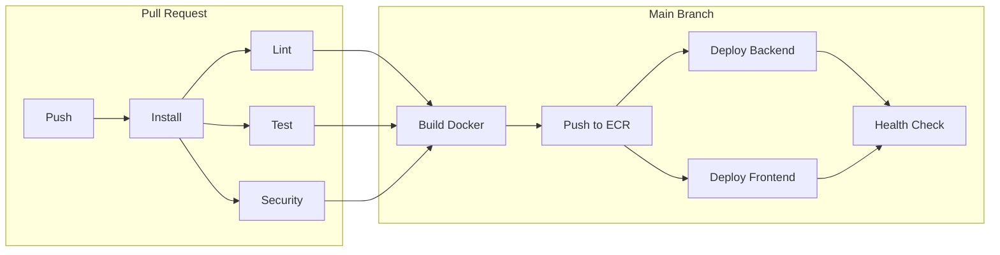

# FileTrace

**Audit-First File Management Platform**

**Live Website:** https://filetrace.vishnuhq.com

## Table of Contents

1. [About](#about)
2. [Features](#features)
3. [Quick Start](#quick-start)
4. [Architecture](#architecture)
5. [CI/CD Pipeline](#cicd-pipeline)
6. [Tech Stack](#tech-stack)
7. [Deployment](#deployment)
8. [Academic Context](#academic-context)
9. [Team](#team)

## About

FileTrace is a file management platform that gives users complete visibility into how their files are accessed and shared. Unlike consumer file management platforms, FileTrace logs every action and makes that information directly available to users.

The platform allows users to upload and organize files into categories, share them through public links or directly with other users, and view detailed audit trails showing exactly when and how their files were accessed. Every upload, download, rename, share, and access attempt is recorded with timestamps and IP addresses.

This project also serves as a DevSecOps comparison study, evaluating GitHub Actions versus GitLab CI/CD by implementing identical pipelines for the same application.

## Features

### User Authentication

- Secure registration and login with JWT tokens
- Password hashing with bcrypt (10 rounds)
- Profile management (edit username, email, change password)
- Account deletion with full data cleanup

### File Management

- Upload files up to 100MB with optional descriptions
- Four categories: Personal, Work, Documents, Archive
- Rename files and move between categories
- Search, filter, and sort your files

### File Sharing

- **Public Links**: Generate shareable URLs that anyone can access
- **User Shares**: Share directly with other FileTrace users by username or email
- Set expiration times (10 minutes to 1 year)
- Limit download counts
- Revoke access anytime

### Audit Logging

- Every action recorded with timestamp, user, and IP address
- Actions tracked: uploads, downloads, renames, shares, access attempts
- Failed attempts to access expired links are logged
- View complete audit history for any file you own

## Quick Start

### Local Development

```bash
# Clone the repository
git clone https://github.com/kspriyanka14/SSW590-FileTrace.git
cd SSW590-FileTrace

# Configure environment
cp server/.env.example server/.env
# Edit server/.env with your MongoDB, JWT, and AWS credentials

# Backend
cd server
npm install
npm run dev

# Frontend (new terminal)
cd client
npm install
npm run dev

# Access the app
# Frontend: http://localhost:5173
# Backend:  http://localhost:3001
```

## Architecture

```
                        ┌─────────────────────┐
                        │    User Browser     │
                        └──────────┬──────────┘
                                   │
                   ┌───────────────┴───────────────┐
                   │                               │
                   ▼                               ▼
       ┌──────────────────────┐       ┌──────────────────────┐
       │ CloudFront (HTTPS)   │       │ CloudFront (HTTPS)   │
       │filetrace.vishnuhq.com│       │api.filetrace.vishnuhq│
       │     (Frontend)       │       │       (API)          │
       └──────────┬───────────┘       └──────────┬───────────┘
                  │                              │
                  ▼                              ▼
       ┌──────────────────────┐       ┌──────────────────────┐
       │    S3 Bucket         │       │   EC2 (t3.micro)     │
       │    Static Site       │       │  Node.js + Docker    │
       └──────────────────────┘       └──────────┬───────────┘
                                                 │
                          ┌──────────────────────┼──────────────────────┐
                          │                      │                      │
                          ▼                      ▼                      ▼
                ┌─────────────────┐  ┌──────────────────┐  ┌──────────────┐
                │ MongoDB Atlas   │  │   S3 Bucket      │  │     ECR      │
                │   Database      │  │  File Storage    │  │Docker Images │
                └─────────────────┘  └──────────────────┘  └──────────────┘
```

**Request Flow:**

1. Browser loads React frontend from CloudFront (cached from S3)
2. Frontend makes API calls through CloudFront to the backend
3. Backend runs on EC2 in a Docker container
4. File metadata stored in MongoDB Atlas
5. Actual files stored in S3 with server-side encryption
6. Downloads use pre-signed S3 URLs (1-hour expiration)

## CI/CD Pipeline

Both GitHub Actions and GitLab CI/CD run the same stages:



**Pipeline Stages:**

- **Install**: Cache and install npm dependencies
- **Lint**: ESLint checks on server code
- **Test**: Vitest with coverage reporting
- **Security**: npm audit + Trivy filesystem scan + Trivy secrets scan
- **Build**: Docker multi-stage build, Trivy image scan, push to ECR
- **Deploy Backend**: SSH to EC2, pull image, run container
- **Deploy Frontend**: Vite build, sync to S3, CloudFront invalidation
- **Health Check**: Verify both endpoints are responding

## Tech Stack

| Category     | Technology            | Version             |
| ------------ | --------------------- | ------------------- |
| **Frontend** | React                 | 19.2.0              |
|              | Vite                  | 7.2.2               |
|              | Tailwind CSS          | 4.1.17              |
| **Backend**  | Node.js               | 24 LTS              |
|              | Express               | 5.0.1               |
| **Database** | MongoDB Atlas         | M0 Free             |
| **Cloud**    | AWS EC2               | t3.micro            |
|              | AWS S3                | 2 buckets           |
|              | AWS CloudFront        | 2 distributions     |
|              | AWS ECR               | Docker registry     |
| **Security** | Trivy                 | Container + FS scan |
|              | npm audit             | Dependency scan     |
|              | bcrypt + JWT          | Auth                |
|              | Helmet + CORS         | Headers             |
| **Testing**  | Vitest                | 4.0.15              |
|              | mongodb-memory-server | In-memory DB        |

## Deployment

### AWS Infrastructure

| Service    | Purpose          | Configuration                  |
| ---------- | ---------------- | ------------------------------ |
| EC2        | Backend hosting  | t3.micro, Ubuntu 24.04, Docker |
| S3         | File storage     | AES-256 encryption, private    |
| S3         | Frontend hosting | Static website, public         |
| CloudFront | Frontend CDN     | Caching enabled, HTTPS         |
| CloudFront | API proxy        | Caching disabled, HTTPS        |
| ECR        | Docker registry  | Private, Trivy scanning        |
| CloudWatch | Monitoring       | 10-widget dashboard            |
| ACM        | SSL certificates | Auto-renewed                   |
| IAM        | Access control   | Least-privilege policies       |

### Deployment Process

1. Push to `main` branch triggers CI/CD
2. Tests and security scans run in parallel
3. Docker image built and scanned
4. Image pushed to ECR
5. Backend: EC2 pulls new image and restarts container
6. Frontend: Vite builds, syncs to S3, invalidates CloudFront
7. Health checks verify both services

## Academic Context

This project was developed for **SSW 590: DevOps Principles and Practices** at Stevens Institute of Technology during Fall 2025.

**Instructor:** Dr. Gregg Vesonder

**Team:**

- Priyanka Kavali Subramanyam
- Pallavi Maralla Satish
- Vishnu Vardhan Putta

## Documentation

- [Backend Documentation](./server/README.md)
- [Frontend Documentation](./client/README.md)
