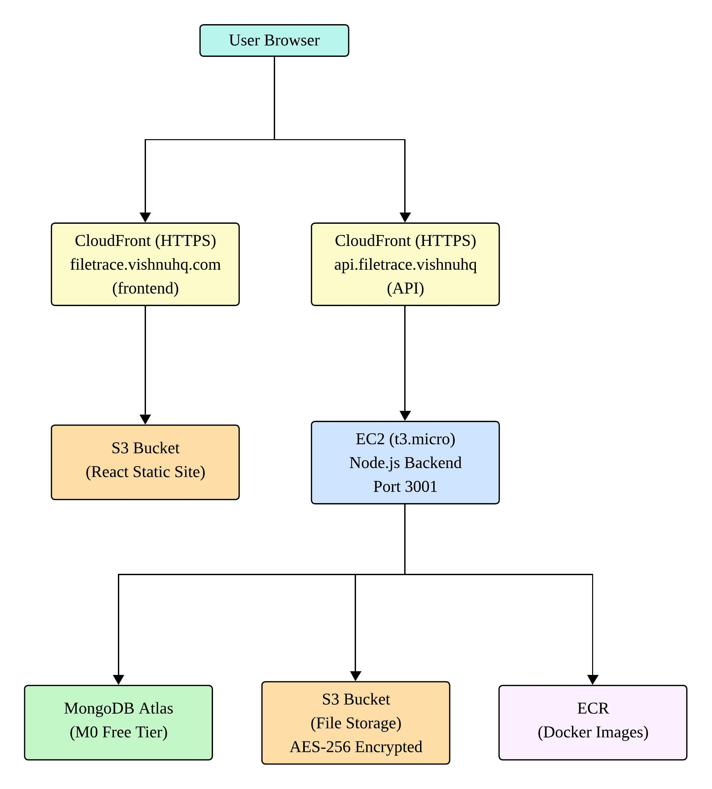
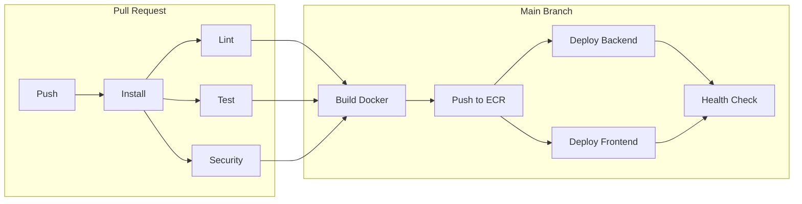
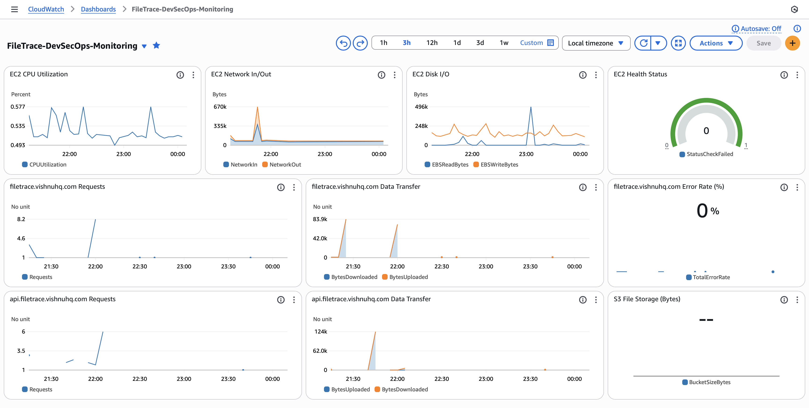

# FileTrace: An Audit-First File Management Platform

Full-stack file management platform for secure file storage, sharing, and detailed audit logging, developed and deployed using comprehensive DevOps practices. Built as part of the SSW 590 DevOps Principles and Practices course project.

## Table of Contents

1. [About](#about)
2. [Features](#features)
3. [System Architecture](#system-architecture)
4. [AWS Infrastructure](#aws-infrastructure)
5. [CI/CD Pipeline](#cicd-pipeline)
6. [Security Implementation](#security-implementation)
7. [Monitoring & Operations](#monitoring--operations)
8. [Docker Configuration](#docker-configuration)
9. [Tech Stack](#tech-stack)
10. [Local Development](#local-development)
11. [Academic Context](#academic-context)

## About

FileTrace is a file management platform that gives users complete visibility into how their files are accessed and shared. Unlike consumer file management platforms, FileTrace logs every action and makes that information directly available to users.

The platform allows users to upload and organize files into categories, share them through public links or directly with other users, and view detailed audit trails showing exactly when and how their files were accessed. Every upload, download, rename, share, and access attempt is recorded with timestamps and IP addresses.

This project also serves as a DevSecOps comparison study, evaluating GitHub Actions versus GitLab CI/CD by implementing identical pipelines for the same application.

## Features

### User Authentication

- Secure registration and login with JWT tokens
- Password hashing with bcrypt (10 rounds)
- Profile management (edit username, email, change password)
- Account deletion with full data cleanup

### File Management

- Upload files up to 100MB with optional descriptions
- Four categories: Personal, Work, Documents, Archive
- Rename files and move between categories
- Search, filter, and sort your files

### File Sharing

- **Public Links**: Generate shareable URLs that anyone can access
- **User Shares**: Share directly with other FileTrace users by username or email
- Set expiration times (10 minutes to 1 year)
- Limit download counts
- Revoke access anytime

### Audit Logging

- Every action recorded with timestamp, user, and IP address
- Actions tracked: uploads, downloads, renames, shares, access attempts
- Failed attempts to access expired links are logged
- View complete audit history for any file you own

## System Architecture

<div align="center">
  
  <p><em>Figure 1: FileTrace System Architecture showing AWS infrastructure components</em></p>
</div>

### Request Flow

1. **Browser** loads React frontend from CloudFront (cached from S3)
2. **Frontend** makes API calls through CloudFront to the backend
3. **Backend** runs on EC2 in a Docker container
4. **File metadata** stored in MongoDB Atlas
5. **Actual files** stored in S3 with server-side encryption (AES-256)
6. **Downloads** use pre-signed S3 URLs (1-hour expiration)

## AWS Infrastructure

### Services Used

| Service    | Purpose          | Configuration                      |
| ---------- | ---------------- | ---------------------------------- |
| EC2        | Backend hosting  | t3.micro, Ubuntu 24.04, Docker     |
| S3         | File storage     | AES-256 encryption, presigned URLs |
| S3         | Frontend hosting | Static website, public             |
| CloudFront | Frontend CDN     | Caching enabled, HTTPS             |
| CloudFront | API proxy        | CachingDisabled policy, HTTPS      |
| ECR        | Docker registry  | Private, scan-on-push enabled      |
| CloudWatch | Monitoring       | 10-widget custom dashboard         |
| IAM        | Access control   | Least-privilege policies           |
| ACM        | SSL certificates | Auto-renewed, DNS validation       |

### EC2 Configuration

- **Instance Type**: t3.micro (1 vCPU, 1GB RAM)
- **OS**: Ubuntu 24.04 LTS
- **Security Group**: SSH (port 22), HTTP (port 80), API (port 3001)
- **Docker**: Runs single container with restart policy

### S3 Buckets

| Bucket             | Purpose              | Access  | Encryption |
| ------------------ | -------------------- | ------- | ---------- |
| filetrace-storage  | User file uploads    | Private | AES-256    |
| filetrace-frontend | Static website (SPA) | Public  | None       |

### CloudFront Distributions

| Distribution | Origin          | Cache Policy     | Purpose             |
| ------------ | --------------- | ---------------- | ------------------- |
| Frontend     | S3 bucket       | CachingOptimized | SPA with 24hr cache |
| API          | EC2 (port 3001) | CachingDisabled  | Pass-through to API |

### Cost

Total project cost: **$0** using AWS free tier credits ($100-200 for 6 months for new accounts created after July 2025)

## CI/CD Pipeline

Both GitHub Actions and GitLab CI/CD implement identical 7-stage pipelines:



### Pipeline Stages

| Stage    | Jobs                                       | Secrets Required |
| -------- | ------------------------------------------ | ---------------- |
| Install  | Cache and install npm dependencies         | No               |
| Lint     | ESLint on server code                      | No               |
| Test     | Vitest with mongodb-memory-server          | No               |
| Security | npm audit + Trivy (fs, secrets)            | No               |
| Build    | Docker build + Trivy image scan + ECR push | Yes              |
| Deploy   | Backend to EC2, Frontend to S3             | Yes              |
| Verify   | Health checks for both endpoints           | Yes              |

### Security Scan Configuration

All security scans are **STRICT** (exit-code 1 = fail pipeline):

```yaml
# npm audit - blocks on HIGH/CRITICAL vulnerabilities
npm audit --audit-level=high

# Trivy filesystem scan - blocks on HIGH/CRITICAL
trivy fs --exit-code 1 --severity HIGH,CRITICAL ./server

# Trivy secret scan - blocks on any finding
trivy fs --scanners secret --exit-code 1 ./server

# Trivy image scan - blocks before ECR push
trivy image --exit-code 1 --severity HIGH,CRITICAL --scanners vuln,secret $IMAGE
```

## Security Implementation

### Application Security

| Layer          | Technology     | Configuration                  |
| -------------- | -------------- | ------------------------------ |
| Password       | bcrypt         | 10 salt rounds                 |
| Authentication | JWT            | 24-hour expiration, HS256      |
| Headers        | Helmet         | Default security headers       |
| CORS           | cors           | Whitelist CLIENT_URL only      |
| Validation     | Zod            | All inputs validated           |
| File Storage   | S3             | AES-256 server-side encryption |
| File Access    | Presigned URLs | 1-hour expiration              |

### CI/CD Security

| Check           | Tool         | When            | Strictness    |
| --------------- | ------------ | --------------- | ------------- |
| Dependencies    | npm audit    | Every PR        | HIGH/CRITICAL |
| Source code     | Trivy fs     | Every PR        | HIGH/CRITICAL |
| Secrets in code | Trivy secret | Every PR        | Any finding   |
| Docker image    | Trivy image  | Before ECR push | HIGH/CRITICAL |
| ECR scanning    | AWS native   | After push      | Advisory      |

### IAM Least Privilege

Single IAM user with incremental permissions:

- `s3:PutObject`, `s3:GetObject`, `s3:DeleteObject` on file bucket
- `s3:PutObject`, `s3:DeleteObject` on frontend bucket
- `ecr:GetAuthorizationToken`, `ecr:BatchCheckLayerAvailability`, etc.
- `cloudfront:CreateInvalidation` on frontend distribution

## Monitoring & Operations

<div align="center">
  
  <p><em>Figure 2: AWS CloudWatch custom dashboard showing EC2, CloudFront, and S3 metrics</em></p>
</div>

### CloudWatch Dashboard Widgets

| Widget                   | Metric                     | Purpose                |
| ------------------------ | -------------------------- | ---------------------- |
| EC2 CPU Utilization      | CPUUtilization             | Server load monitoring |
| EC2 Network In           | NetworkIn                  | Incoming traffic       |
| EC2 Network Out          | NetworkOut                 | Outgoing traffic       |
| EC2 Disk Read Ops        | DiskReadOps                | Storage performance    |
| EC2 Instance Health      | StatusCheckFailed          | Uptime monitoring      |
| CloudFront Requests      | Requests                   | CDN traffic volume     |
| CloudFront Data Transfer | BytesDownloaded            | Bandwidth usage        |
| CloudFront Error Rate    | 4xxErrorRate, 5xxErrorRate | Error monitoring       |
| S3 Bucket Size           | BucketSizeBytes            | Storage growth         |
| S3 Object Count          | NumberOfObjects            | File count tracking    |

## Docker Configuration

### Multi-Stage Build

```dockerfile
# Stage 1: Build with dependencies
FROM node:24-alpine AS build
WORKDIR /app
COPY server/package*.json ./
RUN npm ci --only=production && npm cache clean --force

# Stage 2: Production runtime
FROM node:24-alpine
RUN apk add --no-cache dumb-init
RUN rm -rf /usr/local/lib/node_modules/npm /usr/local/bin/npm /usr/local/bin/npx
RUN addgroup -g 1001 -S nodejs && adduser -S nodejs -u 1001 -G nodejs
COPY --from=build --chown=nodejs:nodejs /app/node_modules ./node_modules
COPY --chown=nodejs:nodejs server/ ./
USER nodejs
ENTRYPOINT ["dumb-init", "--"]
CMD ["node", "server.js"]
```

### Security Features

| Feature           | Implementation                                                                 | Purpose                      |
| ----------------- | ------------------------------------------------------------------------------ | ---------------------------- |
| Non-root user     | `addgroup -g 1001 -S nodejs && adduser -S nodejs -u 1001 -G nodejs`            | Principle of least privilege |
| npm removed       | `rm -rf /usr/local/lib/node_modules/npm /usr/local/bin/npm /usr/local/bin/npx` | Fix CVE-2025-64756           |
| dumb-init         | PID 1 signal handling                                                          | Graceful shutdown            |
| Health check      | HTTP endpoint every 30s                                                        | Container orchestration      |
| Multi-stage build | Separate build and runtime                                                     | Smaller image, fewer vulns   |

### Final Image

- **Base**: node:24-alpine
- **Size**: ~200MB
- **User**: nodejs (UID 1001)
- **Exposed Port**: 3001
- **Health Check**: `/health` endpoint

## Tech Stack

| Category     | Technology            | Version             |
| ------------ | --------------------- | ------------------- |
| **Frontend** | React                 | 19.2.0              |
|              | Vite                  | 7.2.2               |
|              | Tailwind CSS          | 4.1.17              |
|              | React Router          | 7.9.6               |
| **Backend**  | Node.js               | 24 LTS              |
|              | Express               | 5.0.1               |
|              | MongoDB (native)      | 6.11.0              |
| **Database** | MongoDB Atlas         | M0 Free Tier        |
| **Cloud**    | AWS EC2               | t3.micro            |
|              | AWS S3                | 2 buckets           |
|              | AWS CloudFront        | 2 distributions     |
|              | AWS ECR               | Docker registry     |
| **Security** | Trivy                 | Container + FS scan |
|              | npm audit             | Dependency scan     |
|              | bcrypt + JWT          | Auth                |
|              | Helmet + CORS         | Headers             |
| **Testing**  | Vitest                | 4.0.15              |
|              | mongodb-memory-server | In-memory DB        |

## Local Development

### Prerequisites

- Node.js 20+ (we recommend 24 LTS)
- npm 10+
- MongoDB Atlas account (free M0 tier works)
- AWS account with S3 access

### Quick Start

```bash
# Clone the repository
git clone https://github.com/kspriyanka14/SSW590-FileTrace.git
cd SSW590-FileTrace

# Configure environment
cp server/.env.example server/.env
# Edit server/.env with your MongoDB, JWT, and AWS credentials

# Backend
cd server
npm install
npm run dev

# Frontend (new terminal)
cd client
npm install
npm run dev

# Access the app
# Frontend: http://localhost:5173
# Backend:  http://localhost:3001
```

## Academic Context

This project was developed for **SSW 590: DevOps Principles and Practices** at Stevens Institute of Technology during Fall 2025.

**Instructor:** Dr. Gregg Vesonder

**Team:**

- Priyanka Kavali Subramanyam
- Pallavi Maralla Satish
- Vishnu Vardhan Putta

## Project Links

- **GitHub Repository:** https://github.com/kspriyanka14/SSW590-FileTrace
- **GitLab Repository:** https://gitlab.com/vishnuhq/stevens-ssw590-filetrace
- **Live Website:** https://filetrace.vishnuhq.com _(No longer active. AWS free tier credits expired, hence CI/CD pipelines have been disabled. The project ran successfully for over a month with live deployment, zero downtime, and no crashes.)_

## Documentation

- [Backend Documentation](./server/README.md)
- [Frontend Documentation](./client/README.md)
